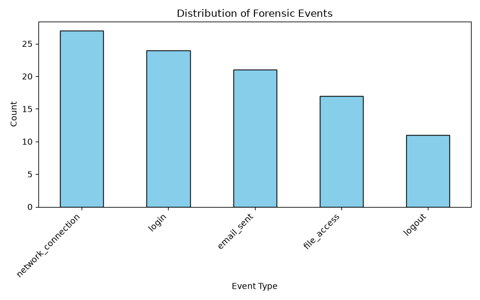

# Forensic Investigation Final Summary Report
 
## 1. Executive Summary
This document synthesizes the outputs from the automated forensic pipeline across the collection, cleaning, feature-engineering, anomaly detection, and entity extraction phases.
 
## 2. Quantitative Metrics
* **Total Forensic Events Processed:** 100
* **Anomalies Flagged (Isolation Forest):** 0
* **Total Named Entities Extracted:** 150
 
## 3. Visualizations
Below is the distribution of events observed across the log history:
 

 
## 4. Key Findings & Extracted Intelligence
The machine learning phase successfully identified high-risk events. The natural language processing (NLP) model extracted key entities from corresponding messages to aid deeper investigation.
 
### Sample Extracted Entities:
user_id                  timestamp  is_anomaly entity_text entity_label
 user_8 2026-08-20 12:42:25.148947           1       Email       PERSON
 user_8 2026-08-20 12:42:25.148947           1    Jane Doe       PERSON
 user_8 2026-08-20 12:42:25.148947           1    John Doe       PERSON
 user_8 2026-08-20 12:42:25.148947           1   Project X          ORG
 user_8 2026-08-20 12:42:25.148947           1      London          GPE 
---
*Report automatically generated on execution of the final pipeline module.*
